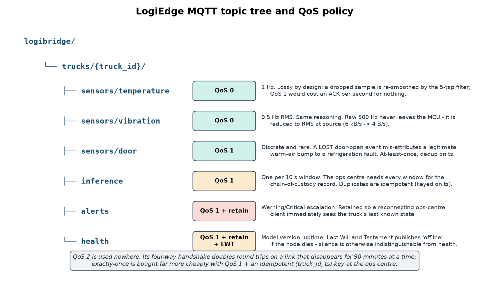

# MQTT Architecture, QoS Policy and Data Fusion (Task C)



## Topic tree

```
logibridge/
└── trucks/{truck_id}/
    ├── sensors/temperature      QoS 0
    ├── sensors/vibration        QoS 0
    ├── sensors/door             QoS 1
    ├── inference                QoS 1
    ├── alerts                   QoS 1, retained
    └── health                   QoS 1, retained, Last-Will-and-Testament
```

`{truck_id}` sits high in the hierarchy, not low, so the ops centre can subscribe
per-truck (`logibridge/trucks/TRK-07/#`) or fleet-wide by function
(`logibridge/trucks/+/alerts`) without a re-design. The PSI monitor uses exactly the
latter form.

## QoS justification, per topic

| Topic | QoS | Why |
|---|---|---|
| `sensors/temperature` | **0** | 1 Hz on `localhost` — the broker is on the same board, so "network loss" means the process died, and a dropped sample is absorbed by the 5-tap moving average anyway. QoS 1 would buy an ACK per second to protect data that is statistically redundant. |
| `sensors/vibration` | **0** | Same reasoning at 0.5 Hz. Note the 500 Hz raw stream is **never published**: it is reduced to an RMS scalar in the sensor MCU (6 kB/s → 4 B/s). Publishing raw and reducing later would be the single largest self-inflicted bandwidth wound in this design. |
| `sensors/door` | **1** | Discrete, rare, and **semantically load-bearing**. A lost `OPEN` event makes a legitimate loading-bay warm-air bump look like an unexplained thermal rise — a false Critical. At-least-once delivery, deduplicated on the immutable `event_id`. |
| `inference` | **1** | One message per 10 s window; every window is part of the chain-of-custody record the hospital audit requires. Redelivery is harmless because the record is keyed and idempotent. |
| `alerts` | **1 + retain** | Escalation must not be lost. Retained so an ops-centre client that reconnects mid-incident immediately receives the truck's last alert instead of waiting for the next one. |
| `health` | **1 + retain + LWT** | Carries model version and uptime. The **Last Will and Testament** is the important part: without it, a dead edge node is indistinguishable from a healthy silent one. The broker publishes `offline` on behalf of the corpse. |

**QoS 2 is used nowhere.** Its four-way handshake (PUBLISH/PUBREC/PUBREL/PUBCOMP)
doubles the round trips on a link whose defining characteristic is that it vanishes
for 35–90 minutes. Exactly-once semantics are bought far more cheaply with QoS 1
plus an idempotent `event_id` unique key at the ops centre — the delivery
guarantee is moved from the transport to the datastore, where it costs nothing on a
dead link.

## Broker placement

Mosquitto runs **on the truck**, bound to `localhost`. This is the architectural
decision the whole offline requirement rests on: the sensor→inference path never
touches the WAN, so a cellular blackout degrades *reporting*, not *detection*. The
ops-centre broker is a separate, TLS-secured, per-truck-credentialed instance that
a separate uplink MQTT client publishes to when a link exists. The local broker is never stopped to simulate a cellular outage.

## Preprocessing design rationale

1. **5-sample moving average.** A causal filter with a 5-sample window at 1 Hz costs
   ~2.5 s of group delay against a 90 s budget — cheap — and knocks the ±0.3 °C
   probe noise down by ~√5. Anything longer (a 15-tap filter, or a Butterworth) would
   start smearing the 0.08 °C/reading drift signature we exist to detect.
2. **30 s window / 10 s step.** The window must be long enough for a slope estimate
   to beat the noise floor (a two-point difference on ±0.3 °C noise is meaningless;
   a least-squares slope over 30 samples is not) and short enough that a fault is
   caught inside 90 s. The 10 s step (66% overlap) means a fault is re-examined every
   10 s rather than every 30 s, cutting worst-case detection latency by 20 s for the
   price of 3× the inference rate — trivial at 1.55 µs per inference on the measured x86 host.
3. **6 features.** `temp_mean`, `temp_std`, `temp_roc` (°C/min, least-squares slope),
   `vib_rms`, `vib_peak`, `vib_kurtosis`. `temp_roc` is what separates Warning from
   a benign door-open bump; `vib_kurtosis` is what catches the impulsive, non-Gaussian
   signature of bearing wear before the RMS has fully risen.
4. **Frozen normalisation.** `training_stats.npy` is fitted once, on clean Normal
   commissioning data, and **loaded** at runtime — never recomputed. See below.

## The normalisation experiment (mandatory, Task C2)

Leakage-safe truck-grouped validation set, M3 INT8, 582 windows (174 true Critical):

| Normalisation | Accuracy | Normal recall | Warning recall | **Critical recall** | Critical windows called Normal |
|---|---:|---:|---:|---:|---:|
| **Correct frozen stats** | **99.14%** | 99.6% | 98.1% | **99.4%** | **0** |
| Shifted **+3 sigma** | 99.14% | 100.0% | 96.9% | 100.0% | 0 |
| Shifted **-3 sigma** | 68.90% | 28.2% | 98.1% | 100.0% | 0 |

The positive shift does not reduce headline accuracy in this seeded experiment, but it
changes the Warning/Normal decision boundary and lowers Warning recall. The negative
shift is operationally severe: Normal recall falls to 28.2%, producing widespread
false alarms and likely alarm fatigue. The result demonstrates that changing the
normalisation reference can materially change model behaviour even when Critical
recall remains high in one synthetic run. Therefore `training_stats.npy` is fitted on
separate known-good commissioning trucks, versioned with the model, loaded at runtime,
and never adapted from live fault data.

Door events are monitored and retained as operational context. The assignment fixes
the model input at six temperature/vibration features, so door state is included in
the inference record and alert audit trail rather than added as a seventh model input.

## Data fusion level (Task C3): FEATURE-LEVEL

We extract features from each stream independently and **concatenate** into one
6-value joint vector before the model.

**Against data-level (early) fusion.** The streams are physically incommensurate:
1 Hz °C and 0.5 Hz g. Data-level fusion means resampling one onto the other's clock
before feature extraction — which either invents temperature samples that were never
measured or throws away half the vibration record. Worse, it destroys `vib_kurtosis`:
kurtosis is a shape statistic of the *vibration* distribution, and it is meaningless
once the series has been interpolated against a thermal clock. Early fusion also
couples the two sensors' failure modes — a dead thermistor would corrupt the
vibration features.

**Against decision-level (late) fusion.** Two independent classifiers plus a voting
rule cannot express the **conjunction** that defines our classes. Per Section 2,
Critical is *"temperature breach OR refrigeration unit failure signature"*, but the
distinction between Warning and Critical in practice is precisely whether thermal
drift is accompanied by a compressor signature — a temp-only classifier and a
vib-only classifier, combined by OR, cannot represent "drift **and** bearing wear
together mean the unit is failing, not that the door was left open." Late fusion
also triples the model count to maintain and OTA-update per truck.

**Feature-level is the right middle.** Each sensor is featurised on its own natural
clock (preserving kurtosis, preserving the °C/min slope), and the model then learns
the cross-sensor interaction terms in a single 803-parameter MLP — one artefact to
train, quantise, ship and monitor. The cost is that the model needs both streams
present; we mitigate that by publishing `health` with LWT, so a dead sensor is an
alarm rather than a silent degradation.
