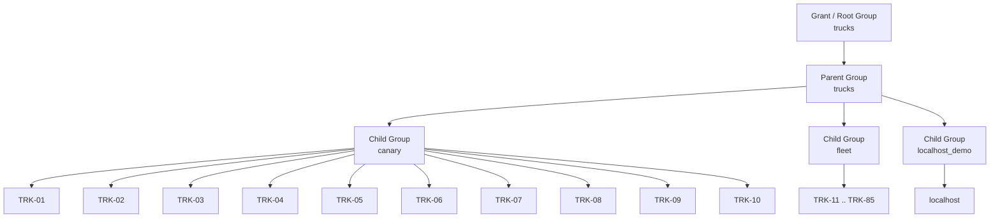

# Deployment Node Map

This map captures the complete inventory hierarchy for the deployment nodes used by the Ansible playbook.

## Hierarchy

- Grant / root group: `trucks`
- Parent group: `trucks`
- Child groups:
  - `canary`
  - `fleet`
  - `localhost_demo`

## Leaf nodes

### `canary`
- `TRK-01` → `10.20.0.11`
- `TRK-02` → `10.20.0.12`
- `TRK-03` → `10.20.0.13`
- `TRK-04` → `10.20.0.14`
- `TRK-05` → `10.20.0.15`
- `TRK-06` → `10.20.0.16`
- `TRK-07` → `10.20.0.17`
- `TRK-08` → `10.20.0.18`
- `TRK-09` → `10.20.0.19`
- `TRK-10` → `10.20.0.20`

### `fleet`
- `TRK-[11:85]` → generated inventory entry for the fleet group

### `localhost_demo`
- `localhost` → local Ansible connection

## Mermaid view

Use this map when targeting deployments with `--limit canary`, `--limit fleet`, or `--limit localhost_demo`.
